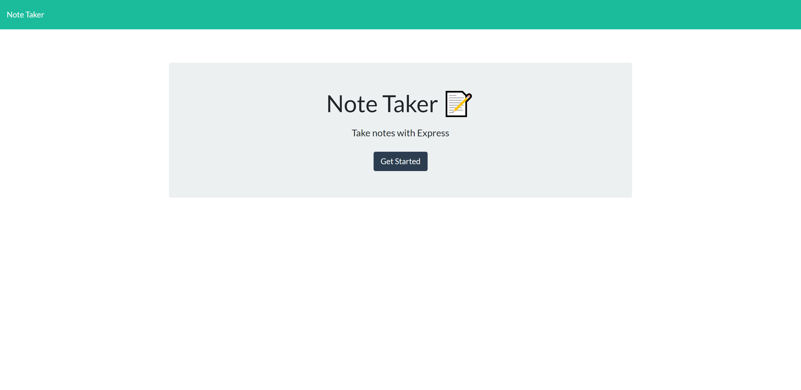
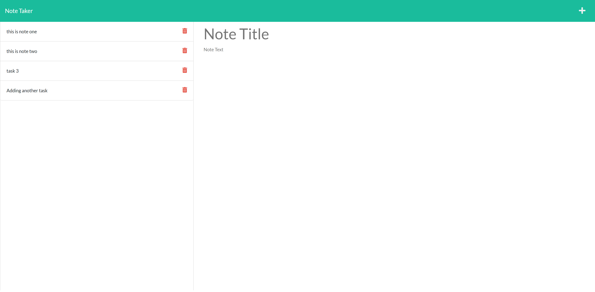

# 11 Express.js: Note Taker

## User Story

AS A small business owner
I WANT to be able to write and save notes
SO THAT I can organize my thoughts and keep track of tasks I need to complete

&nbsp;

---
## Description

This application can take notes and save them for futur reference.  You can also delete notes that are no longer needed (still pending). 

&nbsp;

---
## Usage

* Simply click on the Deployed Heroku APP link to get started.  

* Click the get started button on the front page.  This will bring you to the main page, where you can write your notes.

* Input a note title and type your note.  When done, click the save icon. 

 * You can click on the note to review it and when done, click the "+" icon to start a new note.

 * You can also delete notes by clicking the trash can icon next to the note you want to remove.  (still pending).

&nbsp;

---
## Links

[GitHub Repository](https://github.com/MorningSol/note-taker)

[Deployed Heroku APP](https://immense-dusk-15532.herokuapp.com/)

&nbsp;

---
## Application Demonstration

&nbsp;

